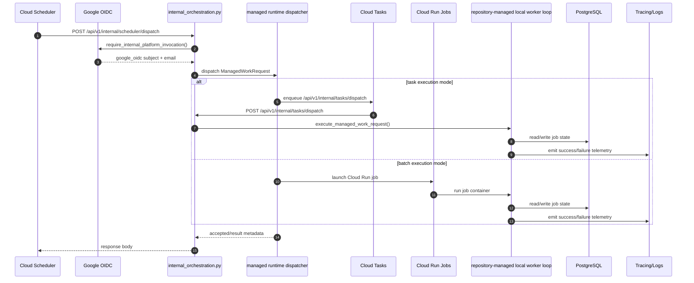

# Managed Scheduler Orchestration Sequence (2026-04-11)

This document captures the managed-runtime orchestration flow spanning:

- `app/modules/governance/api/v1/internal_orchestration.py`
- `app/shared/orchestration/security.py`
- `app/shared/orchestration/runtime.py`
- `app/shared/orchestration/execution.py`
- `app/shared/orchestration/managed_work_runners.py`
- scheduler/job handlers and persistence boundaries

## Core Sequence

## Repository-Managed Local Loop

- Local verification uses the same managed work runners that the production
  runtime calls through the dispatcher.
- The local loop exercises `managed_work_runners.py` directly and does not rely
  on broker-driven fallback behavior.
- Production OIDC delivery targets the direct Cloud Run `run.app` URL while
  validating the public `API_URL` audience through Cloud Run custom audiences.
- The dispatch contract is fail-closed: missing Google identity auth, missing
  Cloud Tasks configuration, or unavailable Cloud Run job metadata should abort
  dispatch instead of degrading to a legacy execution path.

## Concurrency and Deterministic Replay

- Lock and deduplication ownership is explicit at orchestration entry before
  mutable job transitions.
- Job handlers persist state transitions atomically to support deterministic
  replay.
- Deferred paths must log deterministic reason codes (`contention`, `guard`, or
  `dependency_unavailable`) to make reruns reproducible.

## Observability and Snapshot Stability

- Scheduler and handler spans capture:
  - job identity and tenant scope
  - timing and outcome status
  - retry/defer reason codes
- Evidence writes are versioned and persisted with stable schema fields to avoid
  export drift across retries.

## Failure Modes and Operational Misconfiguration Guards

- Google OIDC auth failure:
  - internal scheduler dispatch aborts before work acceptance.
- Cloud Tasks unavailable:
  - task-mode dispatch fails closed and emits explicit telemetry.
- Cloud Run Jobs unavailable:
  - batch-mode dispatch fails closed and emits explicit telemetry.
- Database transaction failure:
  - handler state changes roll back; orchestrator records failure reason and
    retry eligibility.
- Misconfigured queue/schedule:
  - startup/config validation blocks unsafe runtime where required env controls
    are missing.
